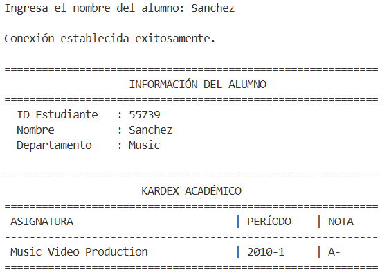
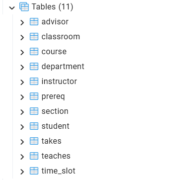

  

<h1 align="center">
  
</h1>

<b>Conectividad Java y PostgreSQL para UniversidadDB | Universidad de Sonora</b>

 

<b>Creador y Modalidad</b>

* **Estudiante:** Natalia Valenzuela ([@NataliaVlza](https://github.com/NataliaVlza))
* **Institución:** Universidad de Sonora (UNISON) - Facultad Interdisciplinaria de Ingenierías
* **Modalidad:** Proyecto guiado y desarrollado en sesiones prácticas de laboratorio.
* **Contacto:** natalia.sanchezvlza@gmail.com
* **Ubicación:** Hermosillo, Sonora, México

 

<b>Descripción del Proyecto</b>

Aplicación de consola en Java que se conecta a una base de datos relacional <b>PostgreSQL</b> (<code>universitydb</code>) a través del controlador <b>JDBC</b>. El programa permite consultar en tiempo real el historial académico (kardex) de cualquier estudiante ingresando su apellido o nombre desde la terminal.

<b>Funcionalidades y Requisitos Implementados:</b>

* **Conexión JDBC:** Establecimiento y gestión segura de conexiones cliente-servidor con PostgreSQL.
* **Consultas SQL Dinámicas:** Recuperación de datos cruzados entre tablas de estudiantes, departamentos, asignaturas y calificaciones mediante sentencias `SELECT` e `JOIN`.
* **Formato de Salida en Consola:** Despliegue estructurado y tabulado del historial académico, mostrando ID de estudiante, departamento, asignaturas cursadas, período lectivo y calificación final.

 

<b>Imágenes del Proyecto</b>

<b>1. Ejecución de la Consulta e Historial Académico</b> 
Muestra la interacción en consola solicitando el nombre del alumno, la confirmación de la conexión exitosa con PostgreSQL y el kardex formateado en pantalla.

 

<b>2. Esquema de la Base de Datos en PostgreSQL</b> 
Estructura de las 11 tablas relacionales de la base de datos <code>universitydb</code> (incluyendo <code>student</code>, <code>course</code> y <code>takes</code>) consultadas mediante JDBC.

 

Créditos de componentes visuales: <a href="https://github.com/kyechan99/capsule-render/blob/main/docs/README_es.md">capsule-render</a> por @kyechan99 y <a href="https://github.com/denvercoder1">readme-typing-svg</a> por @DenverCoder1

  

